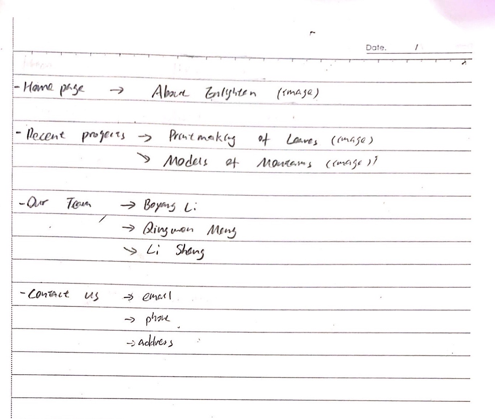
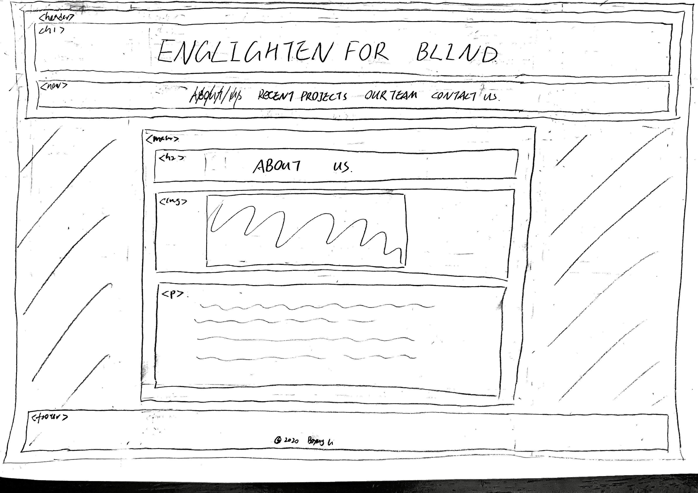
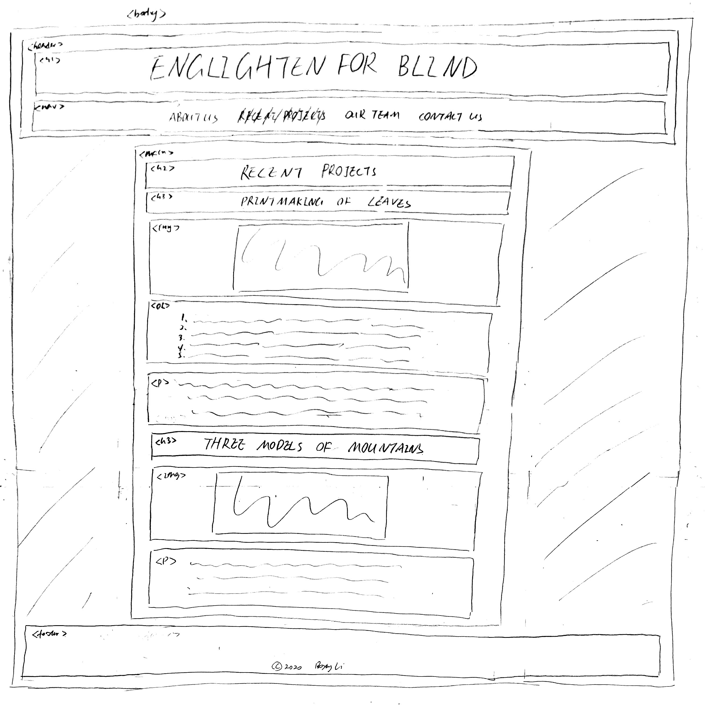
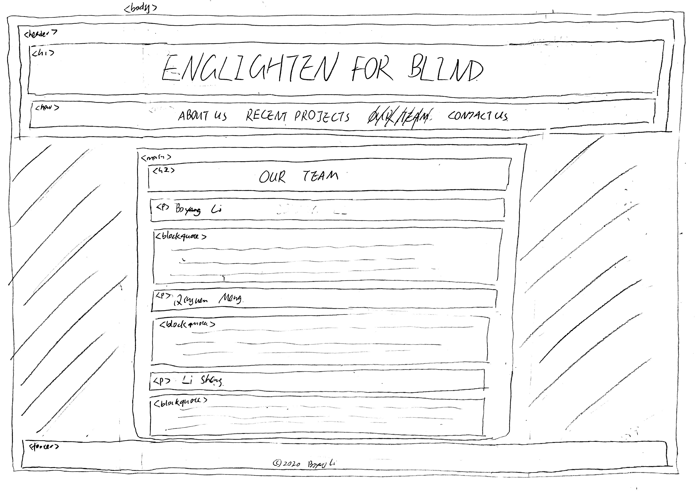
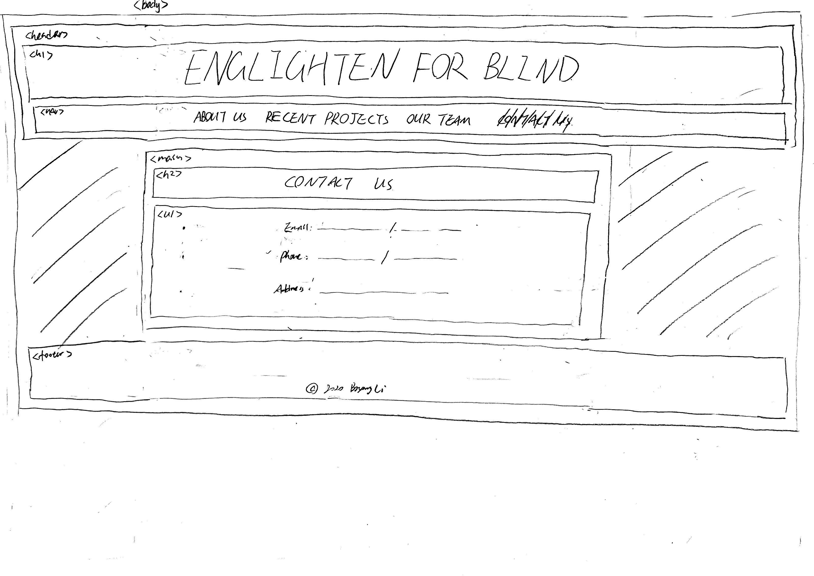

# Project 1: Design Journey

**For each milestone, complete only the sections that are labeled with that milestone.**

Be clear and concise in your writing. Bullets points are encouraged.

**Everything, including images, must be visible in Markdown Preview.** If it's not visible in Markdown Preview, then we won't grade it. We won't give you partial credit either. This is your warning.

## Markdown Instructions

This is a Markdown file. All written documents that you will submit this semester will be Markdown files. Markdown is a commonly used format by developers and bloggers. It's something that you should know. Learning it is a learning outcome of this course.

The following links are Markdown references:
- <https://guides.github.com/features/mastering-markdown/>
- <https://github.com/adam-p/markdown-here/wiki/Markdown-Cheatsheet>

When writing your Markdown file in Atom. Open the command palette and search for **Markdown Preview Plus: Toggle**. This will open up a panel in Atom where you can preview your formatted Markdown file. **The graders will grade you submission in Markdown Preview. All images must be visible in Markdown Preview.**

This is how your insert images into your Markdown documents:

**DELETE THIS SECTION (and example.png) BEFORE THE FINAL SUBMISSION.**

## Audience & Content

**Make the case for your decisions using concepts from class, as well as other design principles, theories, examples, and cases from outside of class.**

You can use bullet points and lists, or full paragraphs, or a combo, whichever is appropriate. The writing should be solid draft quality but doesn't have to be fancy.

**No sketches are required for Milestone 1.**

### Website Topic (Milestone 1)
> Briefly explain what your website will be about.

My website will be about an program I founded, Englighten for Blind. In this program, we teach blind chilren art.

### Audience (Milestone 1)
> Briefly explain who the intended audience(s) is for your website. Be specific and justify why this audience is appropriate for your site's topic.

The intended audiences are people who like to help the disadvantaged, because those people are most likely going to view my webiste since my program relates to their interest.

### Final Content (Milestone 1)
> Briefly describe the content you plan to include in the final site, and why it's the right content for your audiences.

For the text, I plan to include the program's founding story, what we do in this program, what projects we did in the past, our team member's introduction, and the information to contact us. For the images, I plan to include images of the blind children in our program and our program's past projects.
I bascially plan to include everything about my program from the start of it, to give audiences a general idea of my program.

### Home Page Content (Milestone 1)
> Briefly identify what content you will include on the homepage and why this content should be the first thing your target audience sees when they visit your site.

For the home page, I will include the program's founding story, what we do in this program, and an image of a blind children in our program. The image will catch the eyes of audiences first, and it will tell the audience directly that our program is related to the blind before they read any text. And the founding story gives the audiences backgrounds about why I found this program or what inspired me to do so. "What we do in this program" tells the audience in detail what we focus on doing, which is teach blind children art.

## Information Architecture

**Make the case for your decisions using concepts from class, as well as other design principles, theories, examples, and cases from outside of class.**

Each section is probably around 1 reasonably sized paragraph (2-4 sentences).

**No sketches are required for Milestone 2.**

### Audience (Milestone 2)
> A clearer description of audience: who are they, what are they interested in with respect to this site, and what are the design goals for that audience.

The intended audiences are people who like art, like teaching, like to help the disadvantaged, and want to be a volunteer. They could be students or graduates like or majored in art and education, people who have or want to have NGO experiences, people who have empathy and want to do something to help the community, and people who want to join or found a volunteer program.
They will be interest in what we focus on, what we did in the past, the ways to contact us.

### Organization & Navigation (Milestone 2)
> A description of how you generated and considered alternatives for the site's content organization and navigation. You are required to include images here of your card sorting for determining the organization of content and the navigation.

> Thoroughly document this process. The _process_ is the important part of this assignment, not the final result.]

For the homepage, or About Englighten, I will include the program's founding story, what we do in this program, and an image of a blind children in our program.
For the Recent Projects page, I will include two projects we did in the past-teaching blind children printmaking leaves, and having a discussion on the three models of mountains we made, with images.
For the Our Team page, I will include the introduction about our team members.
For the Contact Us page, I will include our contact information: emails, phone numbers, and address.

### Final Organization and Navigation (Milestone 2)
> Explain how the final organization of content and navigation is appropriate for your target audiences.

For the homepage, the image will catch the eyes of audiences first, and it will tell the audience directly that our program is related to the blind before they read any text. And the founding story gives the audiences backgrounds about why I found this program or what inspired me to do so. "What we do in this program" tells the audience in detail what we focus on doing, which is teach blind children art.
For the Recent Projects page, this part includes projects we did in details and with images. The audiences will have an in-depth view about what we did.
For the Our Team page, our team member's introduction tells audiences about what leads us to do this program, and what we look forward to do in the future.
For the Contact Us page, if the audiences are interested in our program, they can contact us to find more details or join our program.

## Visual Design

**Make the case for your decisions using concepts from class, as well as other design principles, theories, examples, and cases from outside of class.**

Remember to focus on the things we can't see just by looking at the site: changes, alternatives considered, processes, and justifications.

Each section is probably around 1 reasonably sized paragraph (2-4 sentences).

### Theme Ideas (Milestone 3)
> Discuss several ideas about styling your site's theme. Explain why the theme ideas are appropriate for your target audiences. Feel free to include some hand-drawn sketches (not digital drawings, not mock-ups, not wireframes, etc.) here to document your design process.

My website is for a program which teaches blind children art. The themes are empathy and caring.
I think sky blue or grass green can convey the themes, because these two colors gives the audience a feeling of nature, which can relate to empathy and caring.

### Theme Design (Milestone 3)
> Discuss your theme designs: how did you come to them, what are their strengths and weaknesses, how do they fit your overall design goals and audiences?

> Emotion is a big part of design. What emotions where you thinking about or trying to convey in your designs?

My idea of using sky blue and large imagines of children comes from UNICEF's website. I used it as a reference what a NGO's website typically look like. The strength is expressing the right emotions to the audience: empathy and caring. And audience will know it looks like a NGO. However, the weakness is that many the NGOs would also design their websites like this, which would probably makes my website too common and not special.
I will use darker blue or green for the titles and text, and lighter blue for green for the backgrounds, which provides enough contrast for the audience to see. At the same time, I think using large imagines of the children in our program can evoke the empathy of the audience.
Moreover, in order to make website look cleaner and increase the readability for the audience, I would like to use sans-serif for the text with more spacing between lines. I also want to use special fonts with bold weight and uppercase or capitalize for the titles as an emphasis. I will also make the border visible for the navigation part to make it easier for the audiences to find.

## Rationale

**This rationale should be polished writing: one you might submit as a report to a client or boss to help explain the project and convince them you did a good job. You'll be surprised how much writing and communicating you need to do about projects and choices on internships and jobs; practice that here.**

It should be a comprehensive, complete story of the project. You might find that each section runs a few paragraphs (1-2). Sketches can often help tell the story of your design. Screenshots are also useful for describing issues discovered during the design process and how you addressed them.

**All images must be visible in Markdown Preview for credit!**

Your rationale should be a polished version of the earlier explanations.

### Site Layout (Final Submission)
> Show your design process and final layout for your site. You must include photos of your sketches of the layout. No digital drawings permitted.

> You must label each figure and provide an explanation of the sketch.

Sketch for About us page, which is the home page of my website. Audiences can see the founding story of my program-what inspired me and why did I found this program.

Sketch for Recent project page. Audiences can see two recent projects we did with photos- Printmaking of the leaves (with its process) and Three models of mountains.

Sketch for Our team page. Audiences can see the introduction of the three founders and our thoughts on the program, which gives the audience a sense of what insiders think on the program.

Sketch for Contact us page. Audiences can find emails, phone numbers and address to reach out to us, whether for questions, visits, cooperations, or joining the program.

### Audience (Final Submission)
> A complete and polished description of the intended audience(s) for your website.

The intended audiences are people who are interested in NGOs, want to be volunteers to help the disadvantaged community, like to teach children art, or want to make a change. They could be students or graduates who are insterested or majored in art or education, people who have or wish to have NGO experiences, people who want to do something to for the society, and people who want to join volunteer programs.

### Design Goals (Final Submission)
> An explanation of the design goals for that audience, based on your earlier rationales.

The goal of the website is informing audiences about our program- what inspired us to found the program, what we did in the past, what's our thoughts on this program, and our contact information. So the audiences can have a idea of what we do, what a NGO is like. what is like to be a volunteer. These information could help them to decide whether they want to join our program or other NGOs.

### Navigation (Final Submission)
> An explanation of how the final navigation met your goals and why its appropriate for your audience(s).

I break the nagvigation into four pages-About Us, Recent Projects, Our Team, and Contact Us. For the About Us page, I will include the program's founding story- why did we found this program. For the Recent Projects page, I will include two projects we did in the past-teaching blind children printmaking leaves, and the discussion on the three models of mountains we made. For the Our Team page, I will include the introduction about our team members and our personal thoughts on the program. For the Contact Us page, I will include our contact information: emails, phone numbers, and address. Since the goal of this website is informing, the four pages provide a comprehensive view on our program and enough information for the audiences to know our program.

### Organization (Final Submission)
> An explanation of how the final organization met your goals and why its appropriate for your audience(s).

For the About Us page, the image of a blind children in our program who is writing in braille will catch the eyes of audiences. And it will tell the audience directly that our program is related to the blind children before they read any text. And the founding story gives the audiences backgrounds about why I found this program or what inspired me to do so. It also tells the audience in detail what we focus on doing, which is teaching blind children art. For the Recent Projects page, this part includes projects we did in the past and with images. The audiences will have an in-depth view about what we did. For the Our Team page, our team members' introduction and personal thoughts tell audiences about what leads us to continue this program, and what are we looking forward to do in the future. For the Contact Us page, if the audiences are interested in our program, they can contact us to find more details or join our program.

### Visual Design (Final Submission)
> An explanation of how the final design met your goals and why its appropriate for your audience(s).

My website is for a program which teaches blind children art. The themes are empathy and caring. Blue can convey the emotion of peace, calm, hope, empathy and caring, because blue gives the audiences a feeling of nature, espeacially a feeling of sky and ocean. I use dark blue for the text, mid blue for the headers, navigation bar, footer, and titles, and light blue for the background. It's all blue, which provides simplicity. And it's in different shaes, which provides enough contrast for the audience to see. At the same time, I use imagines of the blink children in our program and their works, which can evoke the empathy of the audience. Moreover, in order to make website look cleaner and increase the readability for the audience, I use sans-serif for the text with extra line heights. I also use special fonts with bold weight and uppercase for the titles as an emphasis.

### Self-Reflection (Final Submission)
> What did you learn from this assignment? What are some of your strengths and weaknesses?

I learned that I need to start early on doing projects and double check the github after I pushed it. If I did both of them, I would not lose files for milestone 1 and 2 or I would make them up before the grading deadline. I think my strengths are willing to do researches on my own, spending more time, and fully immerge in the project. And my weaknesses are starting work late, or procratination, and carelessness.
